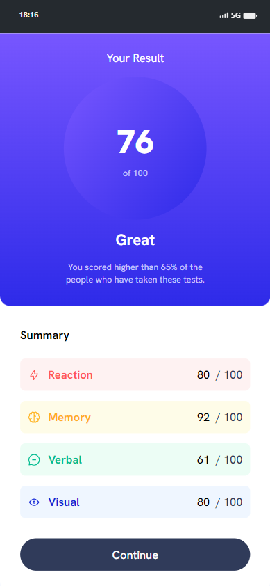
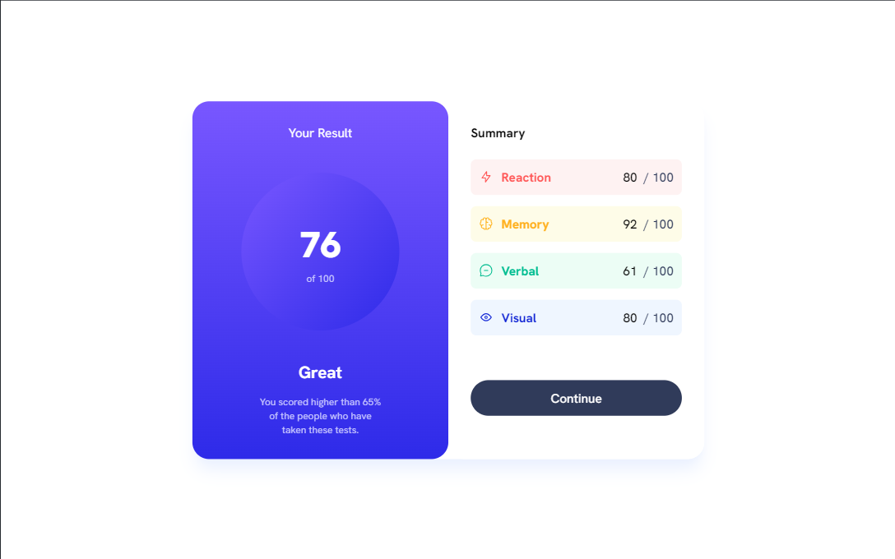

# Frontend Mentor - QR Code Component

This project is a solution to the Results Sumary Components challenge on Frontend Mentor. Frontend Mentor challenges provide a platform to enhance your coding skills by building realistic projects.

## Overview

### The Challenge

The challenge required creating a result sumary with accompanying explanatory text.

### Screenshot

### Links

- Live Site URL: [Here](https://raphaelelias-resultssummarycomponents.netlify.com)

## My Process

### Built With

- HTML
- Tailwind CSS

### What I Learned

During this project, I reinforced my understanding of:

- Using Tailwind CSS for styling
- Basic HTML structure

### Continued Development

In future projects, I aim to:

- Explore more advanced Tailwind CSS features
- Dive deeper into HTML and CSS techniques

### Useful Resources

- [Tailwind CSS Documentation](https://tailwindcss.com/docs) - Helpful for understanding Tailwind CSS classes and features.

## Author

- Linkedin - [Linkedin](https://www.linkedin.com/in/raphaeleliass)
- GitHub - [Github](https://www.github.com/raphaeleliass)
- Instagram - [Instagram](https://www.instagram.com/raphaeleliass)

## Acknowledgments

- Challenge by [Frontend Mentor](https://www.frontendmentor.io?ref=challenge).
- Coded by [Raphael Elias](https://www.github.com/raphaeleliass).
